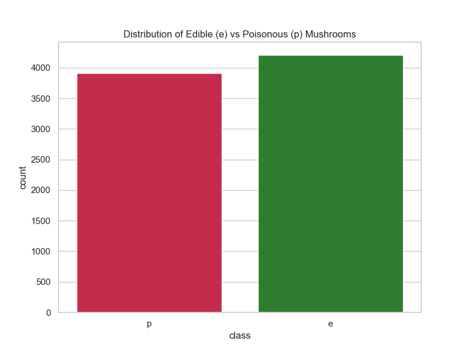
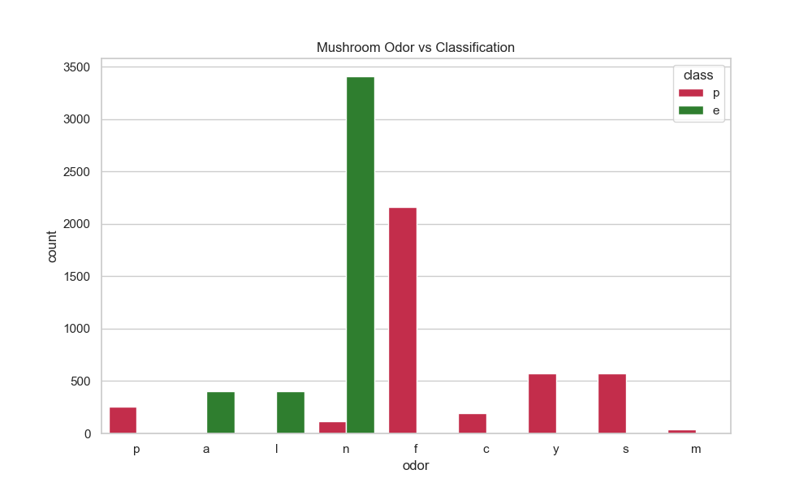
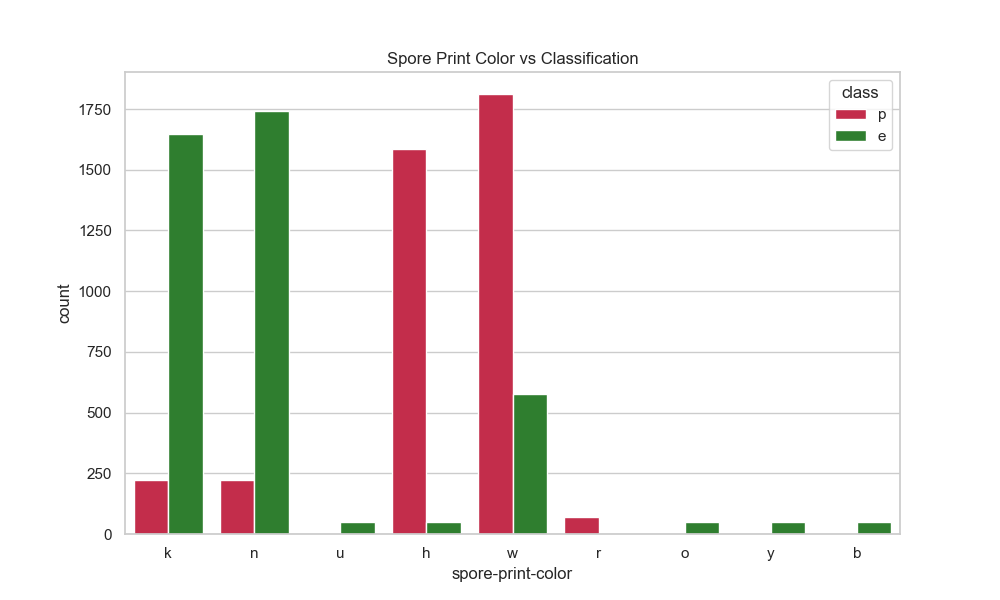
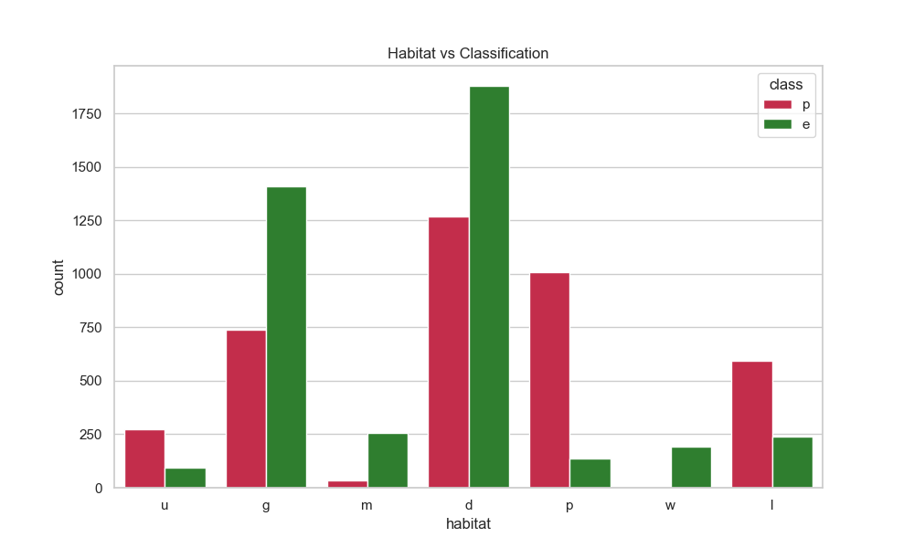
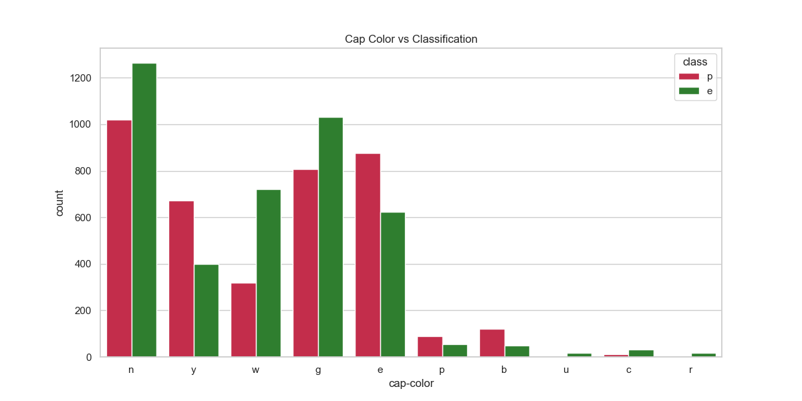
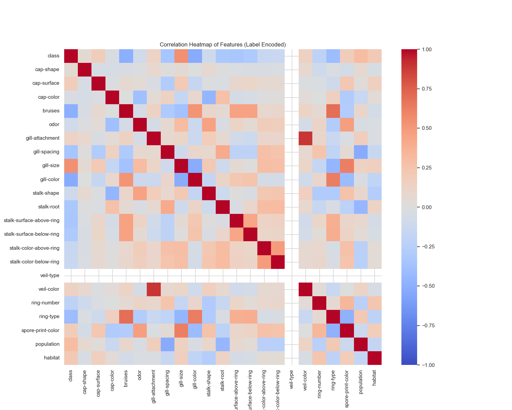

# Mushroom Classification - Data Analysis Report
## 1. Data Cleaning
- **Missing Values**: Replaced '2480' instances of '?' with NaN. The 'stalk-root' column has missing values.
- **Imputation**: Filled missing values in 'stalk-root' with the mode value.
- **Duplicates**: Found and removed 0 duplicate rows.
- **Data Types**: All columns are categorical (object). Distribution: {dtype('O'): 23}
- **Outliers (Rare Categories)**: As data is categorical, we checked for categories representing < 1% of the data. Some rare categories found in columns like 'cap-shape', 'cap-color', 'gill-color' etc. They were kept as they represent valid rare variations of mushrooms.

## 2. Visualizations
### 1. Class Distribution
The dataset is fairly balanced between edible and poisonous mushrooms, with slightly more edible ones.

### 2. Odor vs Classification
Odor is a very strong predictor. For example, all mushrooms with foul (f) odor are poisonous, while those with no odor (n) or almond (a) are mostly edible.

### 3. Spore Print Color vs Classification
Spore print color also shows clear distinctions. Chocolate (h) and white (w) spores often indicate poisonous mushrooms, while brown (n) and black (k) are mostly edible.

### 4. Habitat vs Classification
Mushrooms found in paths (p) or urban (u) areas tend to be poisonous, while those in woods (d) or grasses (g) are mixed but lean towards edible.

### 5. Cap Color vs Classification
Cap color is less distinctive on its own compared to odor. Brown (n) and gray (g) are the most common colors for both classes.

### 6. Feature Correlation Heatmap
While Pearson correlation is meant for continuous data, using it on label-encoded categorical data gives us a rough idea of linear associations. Gill-color, ring-type, and bruises show noticeable associations with the class.

